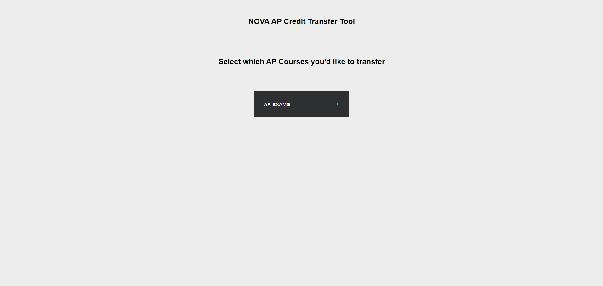
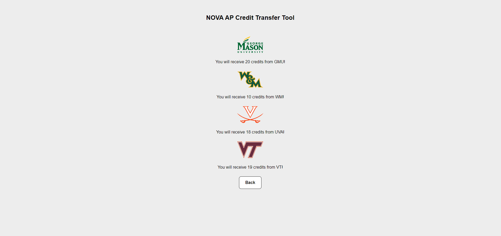

## NOVA AP Credit Transfer Tool
A simple flask application NOVA students can use to quickly calculate how many credits they will receive from their AP Exam scores from various college in NOVA.

#### Link to GMU transfer credit guide: <https://www.gmu.edu/freshman/requirements/exam-credit>

## Setting up the Web-App Locally 

1. Clone The Repository

2. Install Requirements  `pip install -r requirements.txt`

3. To run the app on localhost run `python NOVA.py`

4. app is running at `http://127.0.0.1:5000`

## How to use:

1. Select which AP courses you would like to transfer, selected options appear green

2. Once you have selected all the AP courses you would like to transfer scroll and click calculate

3. A series of pop ups will appear prompting you to enter the score you received for each AP course you previously selected

4. Once you are done, you will see how many credits you can receive from the scores you received on your AP courses from colleges such as GMU, WM, UVA, and VT!

## WebApp 
#### Home Page 

#### Results Page 

